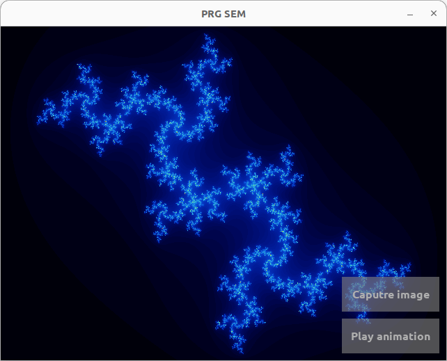

# Julia set visualizer
An application meant for visualizing various Julia sets. It is capable of computing julia sets in real time as the user moves freely in the complex plane. It was used as my semestral project at [CTU FEE](https://fel.cvut.cz/cs).



## Project structure
The app is divided into two parts. 

First of them being the main control app handling GUI and user interactions. It is also embedded with it's own computation unit providing the real time movement functionality. 

The other part is a standalone computation module, which communicates with the main app via named pipes and takes care of heavy computation. This part was implemented mainly to comply with the semestral project assignment.

### Directory structure:
```
├── fonts
├── images
├── libs
│   ├── src_cp_lib
│   ├── src_err_lib
│   ├── src_hlp_lib
│   ├── src_io_lib
│   ├── src_msg_lib
│   └── src_trc_lib
├── src
└── src_cmp_mod
```
Main app source code is located in [src](src) directory. Source and header files aren't separated further. Compute module code is analogically located under [src_cmp_mod](src_cmp_mod) directory.

All the shared functionallity between the two is delegated into the [libs](libs) directory and it's subdirectories:

- [src_cp_lib](libs/src_cp_lib) takes care of the main computation heavy lifting
- [src_err_lib](libs/src_err_lib/) ensures shared error handling across entire codebase
- [src_hlp_lib](libs/src_hlp_lib/) provides helpers simplifying repetitive tasks
- [src_io_lib](libs/src_io_lib/) unifys communication through named pipes
- [src_msg_lib](libs/src_msg_lib/) contains shared simple protocol used for communication
- [src_trc_lib](libs/src_trc_lib/) is used for terminal control tasks

All of above are compiled and packed into individual C static libraries and later linked to the executables.

## Compilation
This project was developed under [GCC 11.4.0](https://gcc.gnu.org/gcc-11/) and is written in C99. Operating system used was completely minimal installation of [Ubuntu 22.04.4 LTS](https://releases.ubuntu.com/jammy/).

The only dependencies required are those from [SDL2](https://www.libsdl.org/) library. Except for [SDL2](https://www.libsdl.org/) itself [SDL2_image](https://wiki.libsdl.org/SDL2_image/FrontPage) and [SDL2_ttf](https://wiki.libsdl.org/SDL2_ttf/FrontPage) extensions are required.

After all of theese conditions are met compilation is handled by [GNU Make](https://www.gnu.org/software/make/manual/make.html). [Makefile](Makefile) is located in the [root](/) directory of the project.

## Controls
The GUI of the app is fairly minimal and thus most of the functionality is accessed through keybinds. Input is read from both underlying terminal and SDL window.

### Keybinds
```
g - gets the version of the compute module
s - requests new computation
1 - starts computation
a - pauses computation
r - resets computation
l - clears computation done so far
c - switches app to the local mode (real time mode)
u - plays predefined animation
i - captures image of the current Julia set
m - increases value of the constant
n - decreases value of the constant
```
All of the keybinds are customizable. Current bind can be found in [keyboard.h](src/keyboard.h) file.

While in local mode you can move in the complex plane by left clicking and draging with mouse/touchpad. Zooming is realized via scroll.

## Notes
In order for the project to work properly both parts of the app must be running. The communication relies on existence of the named pipes, which can be created using [create_pipes.sh](/create_pipes.sh) shell script.

Hope you like the project :D!!
